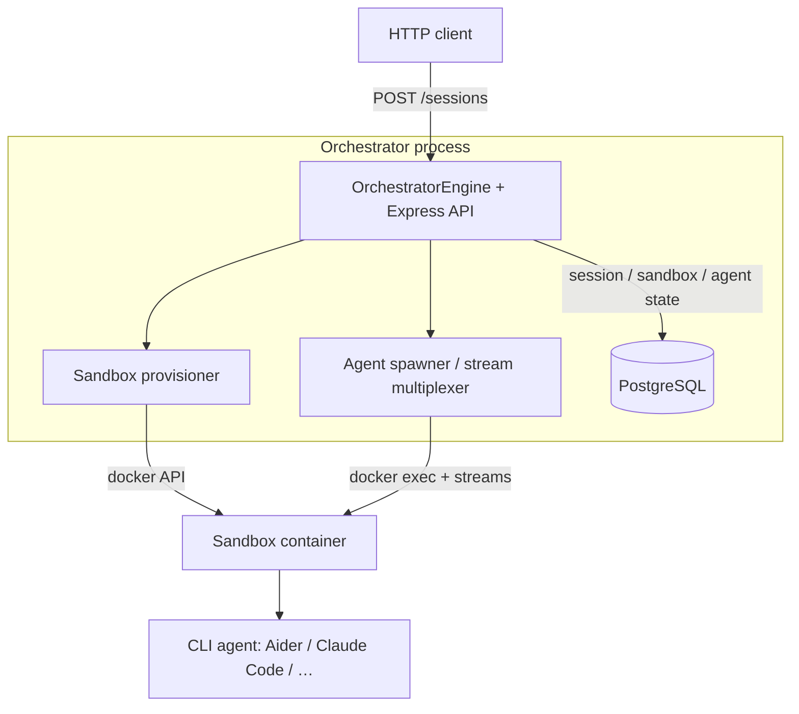

# AetherMux

[](https://github.com/treksavvysky/aethermux/actions/workflows/ci.yml)

> A cross-platform **web workstation for multi-agent orchestration**.

AetherMux is a web-first, containerized orchestrator that multiplexes terminal
agents, browser sandboxes, and persistent database sessions into a single unified
dashboard. It is built for the **solo developer** who has moved from *writing code*
to *orchestrating fleets of specialized AI agents* (Claude Code, Aider, Codex,
Gemini CLI) — eliminating terminal chaos, platform lock-in, and information
blindness.

This repository is the canonical home of the AetherMux orchestrator. Product
strategy, issue contracts, and roadmaps are tracked in **Fluxion Core** under the
`AETHERMUX` product.

---

## Why it exists

Running many agents in parallel introduces severe friction:

- **Terminal chaos** — standard emulators can't separate concurrent agent workflows.
- **Platform lock-in** — desktop-native multiplexers (e.g. CMUX) are macOS-only.
- **Information blindness** — it's hard to tell when an agent is stuck, waiting, or done.
- **Transient context** — sandbox and session state is lost on restart or disconnect.

AetherMux bridges these gaps with multiplexed workspaces, visual attention rings,
and sessions that survive infrastructure restarts and network drops.

---

## Boundaries (what AetherMux is **not**)

These perimeters keep the product focused. Crossing one requires an explicit owner decision.

- **Not an agent or LLM framework.** No proprietary LLM logic or prompting. AetherMux is the
  utility wrapper and interface layer for existing CLI agents.
- **Not a project tracker.** *Where* agents execute (sandboxes, sessions, streams, attention)
  is ours; *what* work exists and why (issues, contracts, roadmaps) belongs to Fluxion Core.
- **Not a code host or file store.** Code and custom agent instructions live in Git. The session
  DB holds only ephemeral coordination state.
- **Not an IDE or terminal emulator.** We embed web VS Code and VNC; we multiplex and route,
  rendering is delegated.
- **Not a desktop application.** Web-first is the founding constraint. The browser — on Linux,
  macOS, Windows, or a tablet — is the only client.
- **Not a team platform.** Built for the solo operator. No accounts beyond the operator, no RBAC.

### Standing invariants

- **Agnosticism first** — every agent CLI integrates via the same spawn/stream contract.
- **HITL hand-off is sacred** — the attention system must never miss or fake a request for input;
  false greens are defects of the highest severity.
- **Sessions survive infrastructure** — restarts and network drops must never lose orchestration state.

---

## Phase 1 — The Core Multiplexer (current scope)

This repository currently targets **Phase 1**: standing up the orchestrator foundation.

- An orchestrator process that provisions and tears down isolated **Docker sandboxes** per repo/task.
- Spawning CLI agent instances inside sandboxes through **one generic spawn contract**.
- Multiplexing agent `stdout`/`stderr` with **per-agent stream buffering** and clean, attributable logs.
- Persisting **session-to-workspace mappings** in PostgreSQL so sessions survive orchestrator restarts.

> Later phases: **Phase 2** — the unified web console (split-pane terminals, live VNC, attention rings);
> **Phase 3** — inter-agent hand-offs via `/command-invoke`.

### Architecture (Phase 1)

A single orchestrator process exposes an HTTP API, persists session state in
PostgreSQL, and drives the host Docker daemon to provision sandbox containers in
which CLI agents run. Agent stdout/stderr is multiplexed per agent and streamed
into the database so sessions survive a restart.



On `SIGTERM` the engine marks sessions `paused` and exits; on startup it queries
`paused` sessions and reconnects to any sandbox still running (otherwise marks it
`orphaned`).

A **WebSocket transport** on the same server (`/ws`) streams live per-agent
stdout/stderr to browser clients and accepts stdin — the real-time path the
Phase 2 console builds on. See [`WEBSOCKET.md`](./WEBSOCKET.md).

### Repository layout

```
src/sandbox/        # Docker sandbox provisioning engine (AETHERMUX-3)
src/orchestrator/   # generic agent spawn contract + stream multiplexer (AETHERMUX-4)
src/persistence/    # PostgreSQL session-state store + migrations (AETHERMUX-5)
src/server/         # orchestrator engine, HTTP API, and WebSocket transport (AETHERMUX-6, -12)
src/main.ts         # process entry point (npm start)
test/               # unit + integration test suites
console/            # Phase 2 browser console — Preact + Vite + xterm.js SPA
deploy/             # Dockerfile
DECISIONS.md        # architecture decision log (language, runtime, etc.)
DEPLOYMENT.md       # deployment guide (Compose, env vars, cloud VMs)
WEBSOCKET.md        # real-time streaming protocol (/ws framing + auth)
```

The **Phase 2 web console** (a browser-only tabbed dashboard of live xterm.js
terminals over `/ws`, with attention rings) lives in [`console/`](./console/) and
is served by the orchestrator at the same origin. Run the **full stack**
(postgres + orchestrator) with `docker compose up --build`, then open
`http://localhost:8080/?token=local-dev-token` — one port, one token, no CORS.
See [`docs/phase2-console.md`](./docs/phase2-console.md) for the full-stack guide,
running CI checks locally, and the WebSocket envelope reference.

---

## Quick start

Bring up PostgreSQL + the orchestrator with Docker Compose (Compose sets a
local-dev `AETHERMUX_API_TOKEN` of `local-dev-token`; the API is **fail-closed**,
so every request except `/healthz` must present it):

```bash
docker compose up --build
TOKEN=local-dev-token

curl localhost:8080/healthz                      # {"status":"ok"}  (open)

curl -X POST localhost:8080/sessions \           # provision sandbox + spawn agent
  -H "authorization: Bearer $TOKEN" \
  -H 'content-type: application/json' \
  -d '{"command":["sh","-c","echo hello; sleep 30"]}'
# {"sessionID":"s-..."}

curl -H "authorization: Bearer $TOKEN" localhost:8080/sessions/<sessionID>
curl -X DELETE -H "authorization: Bearer $TOKEN" localhost:8080/sessions/<sessionID>
```

`GET /sessions` returns a JSON array of session summaries — each with a real,
lifecycle-derived `attentionState` (`running` | `awaiting-input` | `exited` |
`error`) so the console can colour attention rings before the stream connects.
`DELETE /sessions/:id` terminates gracefully (SIGTERM → SIGKILL). The full
request/response contract is the TypeScript module `src/server/api-types.ts`
(imported by the frontend) and the OpenAPI doc served at `GET /openapi.json`.

See [`DEPLOYMENT.md`](./DEPLOYMENT.md) for env vars, port config, and cloud VM
setup, and [`WEBSOCKET.md`](./WEBSOCKET.md) for the real-time `/ws` transport.

## Tech stack

- **Runtime / language:** Node.js 20+ with TypeScript (ESM). See [`DECISIONS.md`](./DECISIONS.md).
- **Storage:** PostgreSQL (session state only — never files).
- **Sandboxing:** Docker (via `dockerode`); HTTP API via Express.
- **CI:** GitHub Actions — lint, typecheck, build, and test (with a Postgres service) on every push.

## Development

```bash
npm ci              # install dependencies
npm run lint        # eslint
npm run typecheck   # tsc --noEmit
npm run build       # compile TypeScript to dist/
npm test            # node --test (unit tests always run; integration tests
                    #   run when Docker and a test database are available)
npm run test:coverage   # tests with coverage report
npm start           # run the orchestrator (needs DATABASE_URL)
```

Integration tests use a real Docker daemon and a PostgreSQL instance reachable via
`AETHERMUX_TEST_DATABASE_URL`; when either is absent those tests skip cleanly.

## License

MIT
